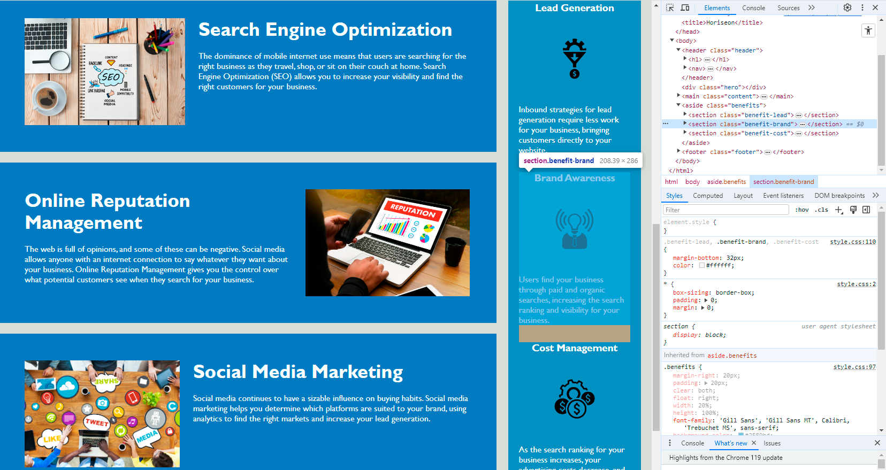

# Day04-challenge Horiseon Webpage
Code Refactor Challenge

## Description 

This Day04-challenge was created for bootcamp students who were taking the first week's challenge. In this challenge, I need to refactor an existing site to make it more accessible. 

The website must meet the following accessibility standards:

* Semantic HTML elements can be found throughout the source code
* HTML elements follow a logical structure independent of styling and positioning
* Image and icon elements contain accessible alt attributes
* Heading attributes fall in sequential order
* Title elements contain a concise, descriptive title

## Installation

N/A

## Usage 

To use this Day04-challenge,  you can review each file. 

To check whether the Horiseon webpage meets accessibility requirements, open the webpage [link](https://qingh2o.github.io/DDay04-challenge/).

Once the Horiseon web page loads, open Chrome DevTools by right-clicking the page and selecting "Inspect". A Elements panel should open either below or to the side of the webpage in the browser. There you will see the title, semantic HTML tags, 'alt' attributes, logical structure, and heading levels. As you click on each element, you will see all styles and positions for each element on the Styles panel.

The page should look similar to the screenshot below.

## Credits

N/A

## License

Please refer to the LICENSE in the repo.